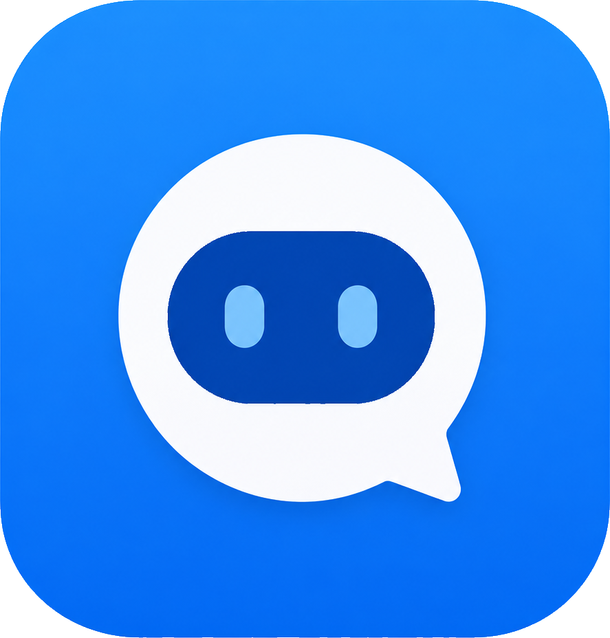
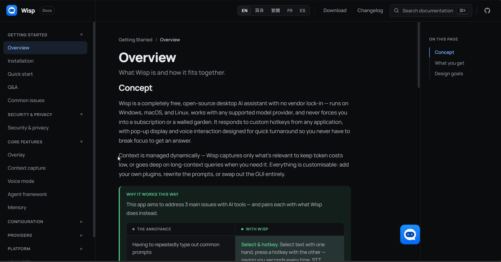
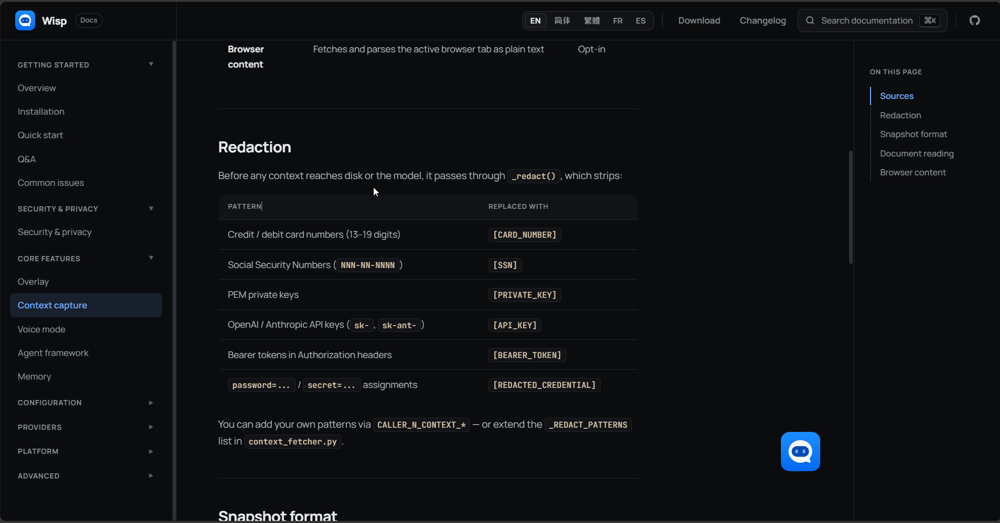
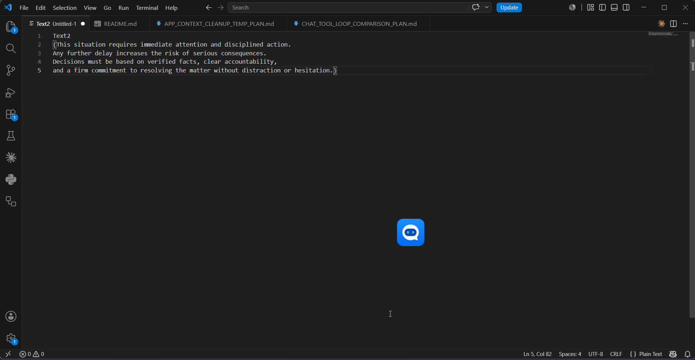
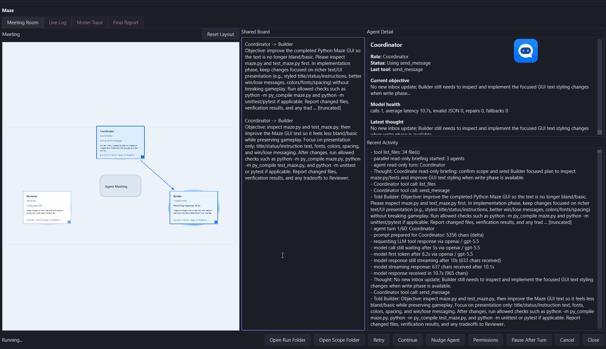

<div align="center">



# Wisp

**Muchas tareas se resuelven mejor con asistencia de IA que con delegación completa. Wisp hace que esa colaboración sea más rápida, fácil de usar y personalizable como plataforma abierta de co-trabajo.**

Wisp te da IA controlada por atajos de teclado que puede leer tu selección, portapapeles, aplicación, navegador, documentos o captura de pantalla mientras te quedas donde estás. Presiona un atajo, elige una acción y transmite la respuesta en una pequeña superposición o en el cursor de entrada. Es completamente open-source, multiplataforma, extensible, con licencia permisiva y 100% Python, así que sigue siendo fácil de modificar: el tipo de apertura que incluso productos de miles de millones de dólares como Microsoft Copilot todavía no ofrecen.

[](#estado-de-plataformas)
[](#inicio-rápido)
[](#privacidad-y-control)
[](#licencia)

**Idiomas:** [English](README.md) | [简体中文](README.zh-CN.md) | [繁體中文](README.zh-TW.md) | [Français](README.fr.md) | Español

**Sitio web:** [Documentación de Wisp](https://sunnylich.github.io/Wisp-AI-Assistant/)

[Inicio rápido](#inicio-rápido) | [Qué hace](#qué-hace-wisp) | [Demos](#demos) | [Configuración](#configuración) | [APIs gratuitas](#fuentes-de-api-de-modelos-gratuitas) | [Privacidad](#privacidad-y-control)



**Consulta en superposición:** Presiona un atajo, elige una acción y obtén una respuesta transmitida sin salir de la aplicación que ya estás usando.
</div>

---

## Problemas conocidos

[Problemas conocidos](https://sunnylich.github.io/Wisp-AI-Assistant/#known-issues)

## Qué hace Wisp

Wisp es para los momentos en que abrir una aplicación de chat interrumpiría tu flujo de trabajo.

Selecciona texto, presiona el atajo general, pulsa una tecla de acción, y Wisp consulta tu modelo configurado solo con las fuentes de contexto que habilitaste. Las respuestas se transmiten en una burbuja compacta junto al ícono flotante. Si el TTS está habilitado, la respuesta se habla a medida que llega.

| En lugar de... | Wisp te permite... |
| --- | --- |
| Copiar texto en una ventana de chat separada | Preguntar desde la aplicación que ya estás usando |
| Volver a escribir las instrucciones para tareas recurrentes cada vez | Guardar acciones reutilizables con las fuentes de contexto que quieras |
| Convertir cada pensamiento en un prompt escrito | Mantener un atajo de voz, hablar y enviar la solicitud transcrita |
| Agotarte leyendo pared tras pared de texto | Transmitir respuestas en la superposición o escucharlas con TTS |
| Explicar manualmente lo que está en pantalla | Capturar selección, portapapeles, documentos, páginas del navegador y capturas de pantalla |
| Confiar tus prompts, contexto y memoria a una plataforma de asistente cerrada | Mantener los datos en tu máquina y enviar solo la información y solicitudes que elijas a tu proveedor de modelo |

## Destacados

- **Superposición primero** — un ícono flotante, selector de acción y burbuja de respuesta se mantienen al frente sin tomar el control de tu escritorio.
- **Agentes ChatGPT/Codex y Claude en vivo** — elige Wisp, ChatGPT o Claude Agent al principio de Configuración y decide si la continuidad permanece en Wisp o se transfiere al agente. El app-server de la CLI de Codex y el SDK de Claude Agent se ejecutan detrás de Wisp con resúmenes de razonamiento, respuestas, progreso de herramientas, aprobaciones y sesiones reanudables opcionales. La importación, devolución y exportación de transcripciones siguen disponibles como alternativa sin conexión.
- **Privacidad por defecto** — Wisp no tiene capa de almacenamiento alojada; los datos se quedan en tu máquina, y el modo privacidad puede advertir o redigir antes de que el contexto sensible salga.
- **Altamente personalizable** — cada atajo, tecla de acción, prompt, fuente de contexto, comportamiento de pegado, ruta del modelo, configuración de voz y dimensión de burbuja se puede cambiar.
- **Interfaz accesible** — la configuración, las verificaciones de configuración, los informes de privacidad, las herramientas de memoria y las advertencias del modelo explican qué está pasando sin necesidad de leer el código.
- **Captura de contexto** — Wisp puede leer texto seleccionado, texto del portapapeles, UI enfocada, documentos abiertos, contenido del navegador, archivos recientes y capturas de pantalla opcionales.
- **Voz de entrada y salida** — STT local mediante faster-whisper, más TTS neuronal en el dispositivo (Kokoro y clonación de voz GPT-SoVITS) o voces en la nube/compatibles (Cartesia, ElevenLabs, OpenAI, cualquier servidor compatible con OpenAI), con TTS deshabilitado por defecto.
- **Capturas visuales** — dibuja una región con `Ctrl+Alt+Q` y envía la captura de pantalla a un modelo de visión.
- **Reescribir y pegar** — usa el atajo de reescritura para reescribir el texto seleccionado con el contexto capturado y pegar el resultado de vuelta en el campo activo.
- **Trae tu propio proveedor** — Groq, Anthropic, OpenAI, Google, DeepSeek, OpenRouter, Mistral, XAI, Together, Cerebras, servidores compatibles con OpenAI personalizados, GitHub Copilot, y más.
- **Memoria local** — la memoria a corto y largo plazo opcional se almacena localmente, con un visor para editar o eliminar hechos.
- **Complementos** — extiende Wisp con hooks, acciones de bandeja, configuraciones, herramientas llamables por el modelo, acciones configurables y atajos.
- **Tareas de agente** — existe un marco de tareas en espacio aislado para trabajos más largos que necesitan descomposición, revisión y artefactos.

## Demos



**Captura visual:** El flujo de captura es para casos donde el contexto visual importa. `Ctrl+Alt+Q` te permite dibujar una región, enviar solo ese recorte a un modelo de visión, y mantener la respuesta en la superposición en lugar de cambiar de aplicación.



**Reescritura contextual:** Wisp puede recopilar contexto útil de la aplicación sin tomar una captura de pantalla, para que el modelo sepa en qué estás trabajando. Luego el atajo de reescritura reescribe solo el texto seleccionado y dirige el pegado de vuelta al campo original capturado cuando presionaste el atajo.



**Ejecución de agente en espacio aislado:** El flujo de tareas de agente es para trabajos de espacio de trabajo más largos. Wisp puede dividir una tarea entre roles de coordinador, constructor y revisor, inspeccionar archivos del proyecto, hacer un cambio enfocado, ejecutar verificaciones, y dejar un informe final y artefactos para la ejecución.

## Flujo de trabajo

| Tu lado | Lo que hace Wisp |
| --- | --- |
| Selecciona texto, elige contexto o dibuja una captura | Captura solo el contexto seleccionado o habilitado |
| Presiona el atajo de llamada y elige una acción o prompt personalizado | Construye la solicitud del modelo con tu prompt y el contexto elegido |
| Envía la solicitud | La envía directamente a tu proveedor de modelo configurado |
| Espera la respuesta | Transmite la respuesta en una burbuja, con TTS automático opcional |
| Guarda información útil para más tarde | Almacena memoria localmente solo cuando la memoria está habilitada |

Flujos de ejemplo:

| Lo que quieres | Lo que hace Wisp |
| --- | --- |
| Quieres una explicación del texto seleccionado | Lee la selección después de que presionas el atajo general y eliges `W` (¿Qué es esto?) o `A` (Explicar simplemente), y luego la explica en la superposición |
| Quieres reescribir una oración | Lee la oración seleccionada, aplica la acción de reescritura que eliges y puede pegar el resultado de vuelta |
| Necesitas hacer tu propia pregunta | Envía tu prompt personalizado con cualquier contexto habilitado para ese llamador |
| Un elemento de UI o imagen es confuso | Envía la captura de `Ctrl+Alt+Q` a un modelo de visión |
| Quieres consultar el modelo por voz | Transcribe tu solicitud de voz con `F9` y la envía como consulta del modelo |
| Quieres dictar en otra aplicación | Transcribe tu voz con `F8` directamente en el campo de texto enfocado |
## Inicio rápido

Hay dos formas compatibles de iniciar Wisp.

### Opción 1: Aplicación empaquetada

Usa esto si quieres la aplicación sin clonar el repositorio o gestionar dependencias de Python.

1. Descarga el último artefacto para tu plataforma desde [GitHub Releases](https://github.com/SunnyLich/Python-AI-assistant-overlay/releases).
2. Descomprime el archivo y inicia la aplicación empaquetada.
3. Abre Configuración para agregar tus claves de proveedor de modelo, configuración de voz y atajos preferidos.

| SO | Artefacto de versión | Iniciar con |
| --- | --- | --- |
| Windows | `Wisp-<tag>-windows-x64.zip` | `Wisp.exe` |
| macOS | `Wisp-<tag>-macos-<arch>.zip` | `Wisp.app` |
| Linux | `Wisp-<tag>-linux-x64.tar.gz` | `Wisp` |

### Opción 2: Lanzador de repositorio

Usa esto si quieres ejecutar desde la fuente, desarrollar Wisp, o probar el último checkout.

Clona el repositorio:

```bash
git clone https://github.com/SunnyLich/Python-AI-assistant-overlay.git
cd Python-AI-assistant-overlay
```

Luego inicia Wisp con el lanzador de repositorio para tu plataforma:

| SO | Iniciar con | Fuente de dependencias |
| --- | --- | --- |
| Windows | `Start Wisp.bat` | `requirements/requirements-windows.lock` |
| macOS | `Start Wisp.command` | `requirements/requirements-macos.lock` |
| Linux | `Start Wisp.sh` | `requirements/requirements-linux.lock` |

El primer lanzamiento aprovisiona el entorno Python e instala las dependencias. Los lanzamientos posteriores van directamente a la aplicación.

Para construir tu propia copia empaquetada, consulta [Construir un EXE](../docs/BUILDING_EXE.md) para los comandos de construcción local y el flujo de trabajo de versión etiquetada.

Requisitos:

- Python `3.12`, fijado en `.python-version`
- Windows 10/11, macOS 13+, o Linux con X11 para el camino completo de atajos/captura de pantalla
- Al menos una clave de proveedor LLM configurada o servidor compatible local

Para registros de ejecución completos, usa el lanzador de depuración correspondiente:

```text
Start Wisp Debug.bat
Start Wisp Debug.command
Start Wisp Debug.sh
```

## Configuración

Usa la ventana de Configuración para la configuración normal. Puede almacenar claves de proveedor, elegir rutas de modelo, configurar voz, ejecutar una verificación de configuración, explicar características opcionales faltantes, y mostrar advertencias para capacidades de modelo no compatibles. Las claves de proveedor y los tokens OAuth se guardan en el **llavero del sistema**: Administrador de credenciales de Windows, Llavero de macOS o Secret Service/KWallet en Linux, **no en un archivo de configuración en texto plano**.

### ChatGPT / Codex y Claude CLI

El primer ajuste de Aplicación, **Ejecutar conversaciones con**, elige el motor tanto para las consultas de la superposición como para la ventana de chat completa:

| Motor | Comportamiento |
| --- | --- |
| **Wisp** | Usa el proveedor LLM y el modelo configurados en Wisp. |
| **ChatGPT** | Ejecuta la CLI de Codex instalada en modo app-server y usa tu cuenta de ChatGPT/Codex. |
| **Claude Agent** | Ejecuta el SDK de Claude Agent con la autenticación de la CLI de Claude Code y usa tu cuenta de Claude. |

Selecciona ChatGPT o Claude Agent para ver su estado de inicio de sesión y las acciones **Iniciar sesión**, **Cerrar sesión** y **Actualizar**. El modo ChatGPT requiere la CLI de Codex; Wisp guarda el inicio de sesión de Codex y las sesiones reanudables en un perfil local aislado para que no aparezcan en tu historial personal de Codex. Claude Agent usa el SDK incluido cuando está disponible y se autentica mediante la CLI de Claude Code.

**La conversación va a** controla la continuidad. Elige **Wisp** para enviar todo el historial local de Wisp en cada solicitud sin conservar un enlace de continuación del proveedor. Elige **ChatGPT** o **Claude Agent** para transferir el historial una vez, guardar el ID de sesión devuelto y reanudar esa sesión del proveedor en los prompts posteriores. Wisp siempre conserva una copia local visible y mantiene los historiales de Wisp, ChatGPT/Codex y Claude en espacios separados, por lo que cambiar de motor no puede añadir mensajes a la conversación equivocada.

Mientras trabaja un agente, Wisp transmite su respuesta junto con cada resumen de razonamiento visible, plan, inicio de herramienta, estado de comando o archivo y solicitud de aprobación que expone el proveedor. La cadena de pensamiento privada y oculta no está disponible. Una insignia del proveedor bajo el icono flotante abre los controles en vivo del siguiente turno: modelo, proyecto, modo rápido, esfuerzo de razonamiento, resúmenes visibles y uno de tres modos de permiso: preguntar, permitir cambios dentro del proyecto o solo planificar en modo de lectura.

El proyecto se selecciona explícitamente o se deduce de la sesión reanudada, los archivos adjuntos y el contexto de archivos; en último caso se usa el directorio actual de Wisp. Cambiar el proyecto inicia una sesión nueva del proveedor. El acceso de escritura del agente queda limitado a ese proyecto; Codex también se ejecuta sin acceso a la red en el entorno aislado del espacio de trabajo.

Las sesiones de agente en vivo son la ruta compatible. La importación, devolución y exportación experimentales de transcripciones son una alternativa local de compatibilidad: la importación lee historiales JSONL de Codex y Claude sin contactar con los proveedores; la devolución requiere confirmación, crea una copia de seguridad completa y añade solo los turnos exclusivos de Wisp; la exportación requiere confirmación y crea una transcripción nueva sin sobrescribir el historial del proveedor. Consulta la [guía completa de agentes en vivo](../Wisp%20Website/Wisp%20Docs.html#live-agents).

Para builds de fuente y configuraciones avanzadas, `.env.example` documenta las claves de configuración disponibles. Por lo general, no necesitas editarlas manualmente.

Para opciones de modelos sin costo y de nivel gratuito, consulta [Fuentes de API de modelos gratuitas](#fuentes-de-api-de-modelos-gratuitas).

## Atajos predeterminados

| Atajo | Acción |
| --- | --- |
| `Ctrl+Q` en Windows, `Ctrl+Alt+Space` en macOS/Linux | Abrir el selector de acción general |
| `Ctrl+Shift+Q` en Windows, `Ctrl+Alt+Shift+Space` en macOS/Linux | Abrir el selector de acción de reescritura/pegado |
| `Ctrl+Alt+Q` | Dibujar una captura de pantalla para visión |
| `Alt+Q` | Agregar la selección actual al búfer de contexto |
| `Alt+W` | Limpiar el búfer de contexto |
| Mantener `F9` | Grabar voz, transcribir y consultar |
| Mantener `F8` | Dictado directo en el campo de texto enfocado |
| `F7` | Leer en voz alta el texto seleccionado |
| `W` / `A` / `D` | Activar filas de acción integradas |
| `S` | Modo de prompt personalizado |
| `Esc` | Cancelar el selector |

Cada llamador, atajo, etiqueta, prompt, fuente de contexto, configuración de pegar de vuelta y dimensión de UI es configurable desde Configuración.

## Complementos

Profundamente extensible, Wisp se transforma con complementos: nuevas funciones, nuevos flujos de trabajo, nuevas posibilidades. Cada complemento vive en su propia carpeta bajo `addons/` con un manifiesto `addon.toml`, y se ejecuta en su propio **proceso de host Python aislado**, por lo que un fallo, un hook lento o una dependencia incorrecta en un complemento no pueden derribar el worker cerebro ni ningún otro complemento. **Las capacidades son opcionales:** un complemento solo obtiene lo que su manifiesto declara, y los permisos faltantes son denegados. Los complementos que necesitan paquetes de terceros obtienen un entorno virtual dedicado que apruebas antes de que se ejecute.

Un complemento puede engancharse a Wisp en varios puntos:

- **Contexto** — leer o reescribir el prompt y el contexto antes de que se envíe una consulta.
- **Herramientas** — registrar herramientas llamables por el modelo que el modelo puede invocar durante la respuesta.
- **Respuestas** — observar las respuestas completadas para registrarlas, guardarlas o reenviarlas.
- **Acciones y atajos** — agregar sus propias filas de acción y atajos globales con prompts personalizados.
- **UI** — contribuir acciones de bandeja, campos de configuración y notificaciones.
- **Acciones LLM** — ejecutar sus propias llamadas de modelo limitadas desde un hook o atajo.

**Qué pueden hacer los complementos:** porque un complemento puede inyectar contexto, exponer herramientas y reaccionar a las respuestas, la superficie es amplia. Algunos ejemplos, y el hook que cada uno usa:

| Quieres... | Hook | El manifiesto necesita |
| --- | --- | --- |
| Extraer tu git diff, calendario, o un ticket abierto al prompt automáticamente | Contexto (`before_query`) | `query = "modify"` |
| Dar al modelo una herramienta para buscar en un wiki interno, consultar una base de datos, llamar a una API de clima o bolsa, o alternar un dispositivo de hogar inteligente | Herramientas (`get_tools`) | `tools = true` (más `[dependencies]` para cualquier paquete) |
| Redactar o etiquetar el contexto sensible saliente para cumplimiento | Contexto (`before_query`) | `query = "modify"` |
| Agregar cada respuesta a un diario diario, o empujarla a Notion o Slack | Respuestas (`after_response`) | `response = "read"` |
| Agregar una acción de "reescribir en nuestro estilo de casa" de una tecla respaldada por su propio prompt | Acciones y atajos | `[[intents]]` / `[[hotkeys]]`, `hotkeys = true` |

Si puedes escribirlo en Python y encaja en uno de los puntos de hook anteriores, puedes conectarlo a la misma superposición controlada por atajos que ya usas.

## Cliente y servidor MCP

### Cliente MCP: usar servidores externos dentro de Wisp

Wisp incluye un complemento **puente MCP** (`addons/mcp_bridge`) que actúa como cliente MCP: indica cualquier servidor de [Model Context Protocol](https://modelcontextprotocol.io) en su `servers.json` y Wisp expone todo su conjunto de herramientas al modelo como herramientas de Wisp. Esto permite que la superposición use capacidades MCP externas sin abandonar el flujo de trabajo de escritorio. Consulta la [Guía de complementos](../addons/README.md) para el contrato completo de manifiesto y hook, o la página **Complementos** en el [sitio de documentación de Wisp](../Wisp%20Website/Wisp%20Docs.html).

### Servidor MCP: servidor de contexto de Wisp

Wisp también incluye un **servidor MCP local por stdio** llamado **Wisp Context Server**. Clientes MCP de confianza, como Claude Desktop, Cursor y Codex, pueden iniciarlo para leer contexto activo del escritorio; la aplicación Wisp no necesita permanecer abierta.

Ofrece cinco herramientas de solo lectura:

- `get_selected_text`: el texto seleccionado actualmente en el escritorio.
- `get_clipboard`: texto del portapapeles.
- `get_active_window`: la aplicación activa, el título de ventana y, cuando está disponible, la URL del navegador.
- `read_browser_page`: texto de la página visible en el navegador.
- `take_screen_snip`: una captura del monitor principal.

### Conectar un cliente

Inicia Wisp una vez y copia la entrada `mcpServers` de `addons/mcp_bridge/claude_config_snippet.json` en la configuración de tu cliente MCP. Wisp genera este fragmento con la ruta local correcta a su propio intérprete de Python y a `addons/mcp_bridge/context_server.py`; no lo sustituyas por Python del sistema. Consulta la [guía de configuración del servidor MCP Bridge](../addons/mcp_bridge/README.md) para notas por plataforma y solución de problemas.

Registra el servidor solo en clientes de confianza: los resultados de las herramientas pueden contener texto seleccionado, contenido del portapapeles, contenido del navegador y capturas de tu escritorio.

## Privacidad y control

Wisp está diseñado como un asistente de escritorio local. **El almacenamiento permanece en tu máquina**, y las solicitudes van directamente al proveedor de modelo o servidor local que configuras.

- **Los datos locales se mantienen locales:** la configuración, los chats, la memoria, los informes de privacidad y la configuración se almacenan en tu máquina.
- **Claves en el llavero del sistema:** las claves de proveedor y los tokens OAuth se guardan en el almacén seguro de contraseñas integrado en Windows, macOS o tu escritorio Linux.
- **Solicitudes directas:** las solicitudes del modelo van directamente desde tu máquina al proveedor o servidor local que configuraste.
- **Tú eliges qué se envía:** tu proveedor de modelo configurado solo recibe el prompt que envías y las fuentes de contexto seleccionadas o habilitadas para ese llamador.
- **Las vistas previas son locales:** Wisp puede inspeccionar el contexto disponible localmente para mostrar estimaciones de tokens, disponibilidad y recuentos de redacción de privacidad antes de que envíes. Previsualizar una fuente no la envía al proveedor de modelo ni la guarda como chat/memoria.
- **La sincronización de chats externos permanece local:** las importaciones son de solo lectura y nunca contactan con los proveedores. Las acciones experimentales de devolución y exportación requieren confirmación; la devolución crea una copia de seguridad y añade contenido a una transcripción existente, mientras que la exportación crea una transcripción nueva sin sobrescribir el historial del proveedor.
- **Contexto controlado por atajo:** el contexto de aplicación ambiental, el portapapeles, los documentos, las páginas del navegador, el contexto de GitHub, la memoria, las herramientas y las capturas de pantalla pueden habilitarse, deshabilitarse o enrutarse según demanda.
- **Modo privacidad:** las verificaciones de configuración y el comportamiento de advertencia orientados a la privacidad se mantienen habilitados, incluyendo el estado de redacción antes de que se envíe el contexto sensible.
- **Inactivo hasta que lo configures:** la voz opcional, la lectura de documentos, el contenido del navegador, las capturas de pantalla, GitHub Copilot y los complementos permanecen inactivos hasta que se configuren.
- **Sin conexiones sorpresa:** el TTS en la nube, los proveedores de modelo, los servidores compatibles o GitHub Copilot solo se contactan cuando configuras y usas esas características.
- **Complementos aislados:** los complementos se ejecutan en procesos de host Python aislados y deben declarar las capacidades que necesitan.
- **Verificaciones de configuración ligeras:** no se importan pilas pesadas de proveedor, audio o STT a menos que la característica esté habilitada.

### Modo de privacidad avanzado

En **Configuración → Aplicación → Modo de privacidad**, elige uno de los tres modos mutuamente excluyentes: **Desactivado**, **Integrado** (predeterminado) o **Avanzado**. El modo integrado usa patrones locales para detectar credenciales, tokens, datos de pago y otros secretos estructurados. El modo avanzado conserva esas reglas y añade el modelo opcional [OpenAI Privacy Filter](https://openai.com/index/introducing-openai-privacy-filter/), que se ejecuta por completo en tu ordenador para detectar según el contexto nombres, direcciones, direcciones de correo electrónico, números de teléfono, URL y fechas privadas, números de cuenta y secretos.

El modelo avanzado es una descarga opcional de unos 2,8 GB, además de su entorno de ejecución local dedicado. Wisp lo carga en memoria y lo calienta en segundo plano al iniciarse o después de activar el modo avanzado. El calentamiento puede tardar decenas de segundos en una CPU. Si envías una solicitud antes de que termine, esa solicitud espera; los análisis posteriores reutilizan el modelo cargado y son más rápidos. Wisp sustituye los fragmentos detectados por marcadores estables como `[PERSON_1]`, puede mostrar una revisión antes del envío y vuelve a comprobar el texto redactado. Si el modelo avanzado no está disponible, la detección falla o queda texto sensible, Wisp bloquea el envío a la nube.

El filtrado de privacidad reduce la divulgación accidental; no garantiza la anonimización ni el cumplimiento normativo.

## Estado de plataformas

| Plataforma | Estado |
| --- | --- |
| Windows 10+ | Compatible |
| macOS 13+ | Compatible* |
| Linux X11 | Compatible |
| Linux Wayland | En curso - estamos trabajando en el soporte de Wayland |

*Esta aplicación solo se probó en macOS durante dos semanas de desarrollo principal, y no puedo probarla después debido al acceso limitado a hardware. Si encuentras bugs en macOS, crea un issue en este repositorio e intentaré solucionarlos lo mejor que pueda. Mejor aún, si puedes aportar una solución, crea un pull request.

## Comentarios y ayuda de plataformas

Los informes de bugs son bienvenidos, especialmente para comportamientos de escritorio que dependen de permisos del SO, gestores de ventanas, dispositivos de audio o servidores de pantalla. Si encuentras un fallo, permiso faltante, atajo roto, problema de captura, fallo de pegado, o advertencia de verificación de configuración que parece incorrecta, por favor abre un issue con tu versión del SO, lanzador, registros y la acción que lo desencadenó.

Los registros se encuentran en la carpeta `build_logs/`.

Estamos trabajando actualmente en el soporte de Linux Wayland, y la ayuda para probarlo o mejorarlo es especialmente útil. Las pruebas de soporte en macOS también son bienvenidas; estas plataformas tienen la mayoría de los casos límite de integración nativa, por lo que los informes del mundo real de diferentes máquinas, entornos de escritorio y estados de permisos hacen que Wisp sea mejor para todos.

Si quieres apoyar este proyecto y la misión más amplia, puedes contribuir directamente al desarrollo o hacer una donación [aquí](https://buymeacoffee.com/sunnylich).

<details>
<summary>Documentación para contribuidores</summary>

- [README del desarrollador](../docs/DEVELOPER_README.md) — configuración, puntos de entrada de ejecución, verificaciones y notas de depuración.
- [Visión general del código](../docs/OVERVIEW.md) — propiedad de subsistemas y límites de ejecución.
- [Guía de complementos](../addons/README.md) — manifiesto de complemento, permisos, hooks, herramientas, atajos y empaquetado.
- [Construir un EXE](../docs/BUILDING_EXE.md) — notas de empaquetado de Windows.

</details>


## Fuentes de API de modelos gratuitas

Wisp es gratuito, y también puedes mantener los costos del modelo en cero. Varios proveedores ofrecen un nivel verdaderamente gratuito, créditos mensuales gratuitos o acceso limitado en velocidad sin costo. Wisp llega a la mayoría de ellos a través de su cliente compatible con OpenAI — algunos tienen un valor `LLM_PROVIDER` dedicado, y el resto funciona a través del endpoint `custom` apuntando `CUSTOM_BASE_URL` a la URL compatible con OpenAI del proveedor. Agrega la clave en **Configuración → LLM**.

| Proveedor | Qué es gratuito | Bueno para |
| --- | --- | --- |
| OpenRouter | Modelos `:free` — ~20 req/min y 50/día sin créditos, 1.000/día después de una recarga única de $10; más un router `openrouter/free` | La opción más fácil de "una API, muchos modelos" |
| Google AI Studio | Nivel gratuito de la API Gemini en regiones compatibles, con límites de velocidad | Trabajo multimodal y de contexto largo, incluyendo visión |
| Mistral | Nivel experimental gratuito en La Plateforme, con límite de velocidad | Modelos europeos amigables con RGPD y llamadas de funciones |
| NVIDIA | Acceso gratuito a la API de muchos modelos abiertos a través del Catálogo de API NVIDIA | Probar muchos modelos de peso abierto en endpoints alojados rápidos |
| GroqCloud | Nivel gratuito con límites de velocidad | Inferencia muy rápida para modelos abiertos como Llama y Qwen |
| Cerebras Inference | Nivel gratuito de API para modelos alojados en Cerebras | Inferencia de texto extremadamente rápida y creación de prototipos |
| GitHub Models | Acceso sin costo con límite de velocidad para cada cuenta de GitHub | Prototipado, experimentos, flujos de trabajo integrados con GitHub |
| Hugging Face Inference Providers | Créditos mensuales gratuitos (actualmente ~$0.10/mes para usuarios gratuitos) | Probar muchos modelos abiertos a través de un ecosistema |
| Cloudflare Workers AI | Plan gratuito de Workers con una asignación diaria gratuita | Aplicaciones ya en Cloudflare; endpoints de IA sin servidor |
| Vercel AI Gateway | Nivel gratuito con $5/mes de crédito de gateway para modelos elegibles | Proyectos Next.js/Vercel; acceso compatible con OpenAI unificado |
| SambaNova Cloud | $5 de crédito de API gratuito, sin tarjeta de crédito requerida | Inferencia rápida de modelos abiertos alojados |
| Puter.js | Acceso JS front-end a muchos modelos sin tu propia clave de API | Aplicaciones de navegador y demos; no es un proveedor backend de Wisp |
| [OmniRoute](https://github.com/diegosouzapw/OmniRoute) (pasarela local) | Enrutador de código abierto que ejecutas localmente; agrupa varias cuentas de proveedores y niveles gratuitos detrás de un endpoint compatible con OpenAI, con enrutamiento, conmutación por error y compresión opcional | Enruta Wisp mediante OmniRoute con el endpoint personalizado: `LLM_PROVIDER=custom`, `CUSTOM_BASE_URL=http://localhost:20128/v1`, un modelo como `auto` y la clave API del panel de OmniRoute |
| Local — Ollama / LM Studio / vLLM | Gratuito cuando ejecutas el modelo tú mismo | Privacidad, sin facturación por token, endpoints locales compatibles con OpenAI |

Los niveles gratuitos tienen límites de velocidad y cambian con frecuencia, así que agrega al menos una ruta de respaldo y evita enviar contexto sensible a proveedores que puedan entrenar con tus prompts (la redacción de Wisp sigue aplicando). Para la guía completa de cómo conectar y advertencias, consulta la página **Fuentes de API gratuitas** en el [sitio de documentación de Wisp](../Wisp%20Website/Wisp%20Docs.html).

## Licencia

MIT
