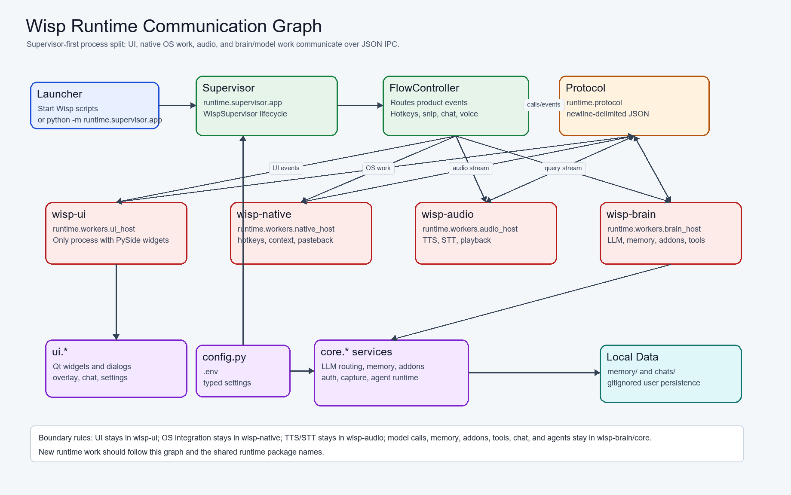
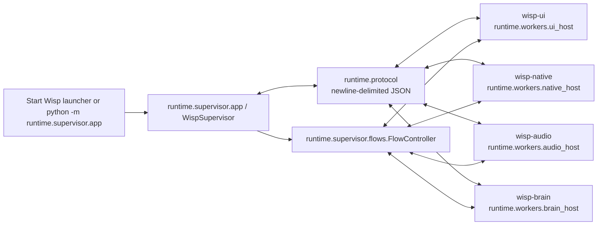
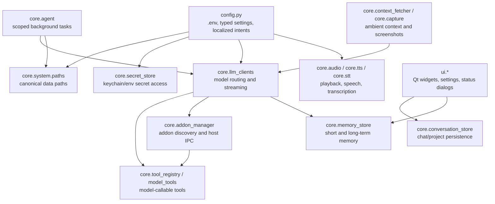
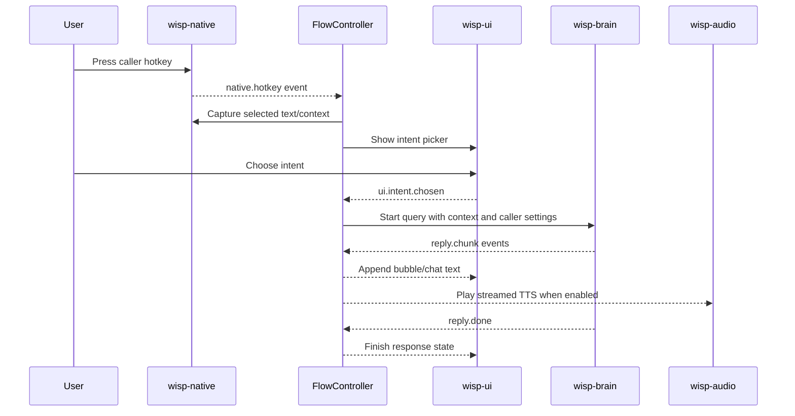
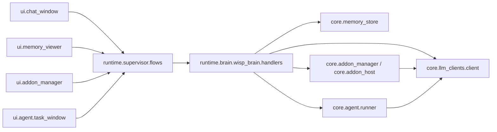
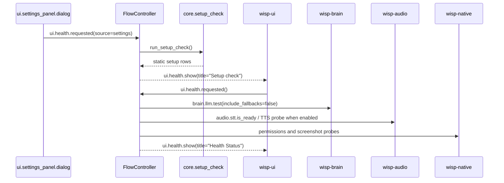

# Wisp Communication Graph

This document shows how Wisp's main files and subsystems talk to each other.
The current architecture is supervisor-first: product flows are coordinated by
`runtime.supervisor`, while UI, native OS work, audio, and model/brain work are
isolated into worker processes.

Rendered image:

Mermaid source: [`communication_graph.mmd`](communication_graph.mmd)

## Process Graph

## Runtime Services

## Hotkey Query Flow

## Chat, Memory, Addons, And Agent Flow

## Settings And Health Flow

## Boundary Rules

- UI work belongs in `wisp-ui` and `ui/`.
- Native OS work belongs in `wisp-native` and platform helpers.
- Audio, STT, and TTS imports belong in `wisp-audio`.
- Model calls, memory, addons, tools, chat, and agent execution belong in
  `wisp-brain` and `core/`.
- The supervisor coordinates flow and lifecycle, but should avoid owning heavy
  domain logic.
- Settings setup checks should stay static and fast; live probes belong to the
  general health-status path.
